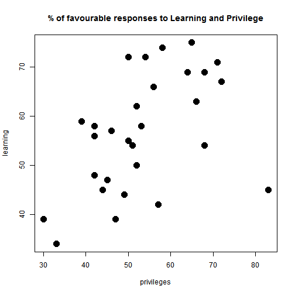
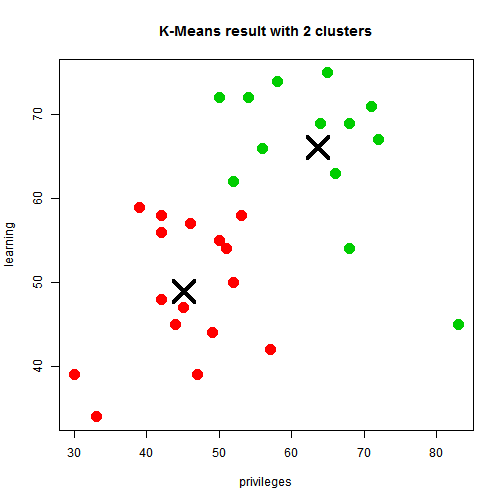
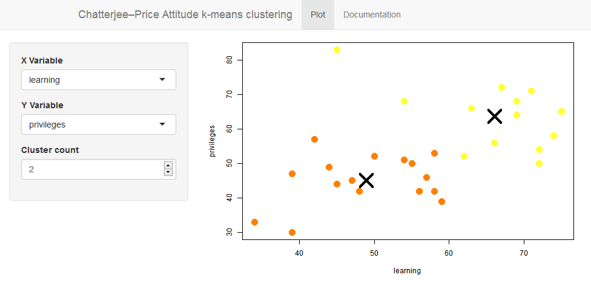

Chatterjee–Price Attitude k-means clustering Shiny Application
========================================================
author: Eduardo Garcia
date: 15/10/2016
autosize: true

Introduction
========================================================

This Shiny Application applies k-means to the Chatterjee–Price Attitude dataset
obtained from the R datasets library. It provides the following features:

- X Y Variable selection
- Cluster count selection
- K-means plot

The Chatterjee–Price Attitude dataset
========================================================

The dataset is a survey of the clerical employees of a large financial 
organization. The data are aggregated from the questionnaires of the 
approximately 35 employees for each of 30 (randomly selected) departments. 
The numbers give the percent proportion of favourable responses to seven 
questions in each department.


```r
# Load the datasets library
library(datasets)

# Inspect the data structure
str(attitude)
```

```
'data.frame':	30 obs. of  7 variables:
 $ rating    : num  43 63 71 61 81 43 58 71 72 67 ...
 $ complaints: num  51 64 70 63 78 55 67 75 82 61 ...
 $ privileges: num  30 51 68 45 56 49 42 50 72 45 ...
 $ learning  : num  39 54 69 47 66 44 56 55 67 47 ...
 $ raises    : num  61 63 76 54 71 54 66 70 71 62 ...
 $ critical  : num  92 73 86 84 83 49 68 66 83 80 ...
 $ advance   : num  45 47 48 35 47 34 35 41 31 41 ...
```

```r
# Data summary
summary(attitude)
```

```
     rating        complaints     privileges       learning    
 Min.   :40.00   Min.   :37.0   Min.   :30.00   Min.   :34.00  
 1st Qu.:58.75   1st Qu.:58.5   1st Qu.:45.00   1st Qu.:47.00  
 Median :65.50   Median :65.0   Median :51.50   Median :56.50  
 Mean   :64.63   Mean   :66.6   Mean   :53.13   Mean   :56.37  
 3rd Qu.:71.75   3rd Qu.:77.0   3rd Qu.:62.50   3rd Qu.:66.75  
 Max.   :85.00   Max.   :90.0   Max.   :83.00   Max.   :75.00  
     raises         critical        advance     
 Min.   :43.00   Min.   :49.00   Min.   :25.00  
 1st Qu.:58.25   1st Qu.:69.25   1st Qu.:35.00  
 Median :63.50   Median :77.50   Median :41.00  
 Mean   :64.63   Mean   :74.77   Mean   :42.93  
 3rd Qu.:71.00   3rd Qu.:80.00   3rd Qu.:47.75  
 Max.   :88.00   Max.   :92.00   Max.   :72.00  
```

Clustering data
========================================================

The goal of this Shiny application is to cluster the attitude dataset with the
responses from all 30 departments for the different variables in order to
understand whether there are commonalities among certain departments. For 
example, if we consider the privileges and learning variables, the initial 
problem looks like this:


```r
# Subset the attitude data
data = attitude[,c(3,4)]

# Plot subset data
plot(data, pch=20, cex=3,
     main="% of favourable responses to Learning and Privilege")
```



K-means
========================================================

K Means Clustering is an unsupervised learning algorithm that tries to cluster 
data based on their similarity. Unsupervised learning means that there is no 
outcome to be predicted, and the algorithm just tries to find patterns in the 
data. In k means clustering, we have the specify the number of clusters we want 
the data to be grouped into.

The Shiny application plots the k-means clustering for the selected variables 
and number of clusters. For example, this is the result for the privileges and
learning variables for 2 clusters:


```r
km = kmeans(data, 2, nstart=100)
      
plot(data, col=(km$cluster +1), pch=20, cex=3, 
     main="K-Means result with 2 clusters")

points(km$centers, pch = 4, cex = 4, lwd = 4)
```



Result
========================================================

This is how the Shinny App finally looks:



The first tab "Plot" contains the inputs and the plot, while the second tab
"Documentation" contains the app documentation.
